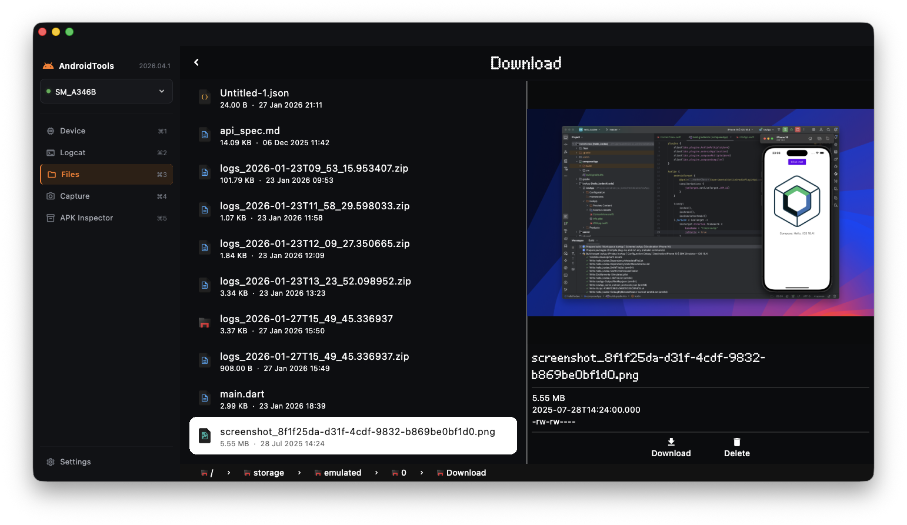
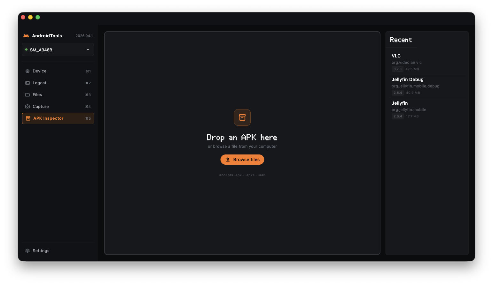
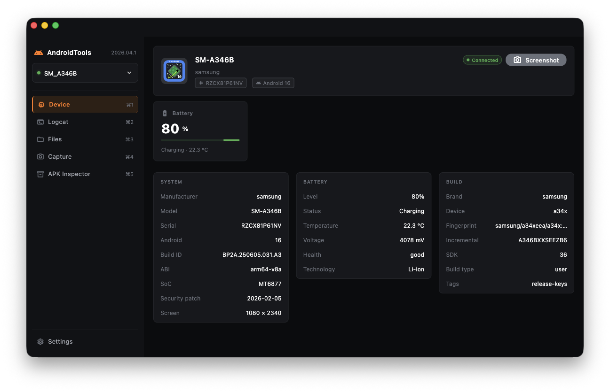
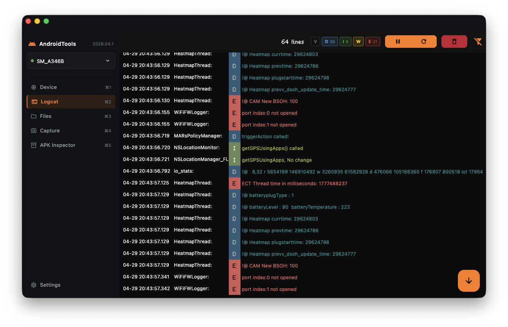
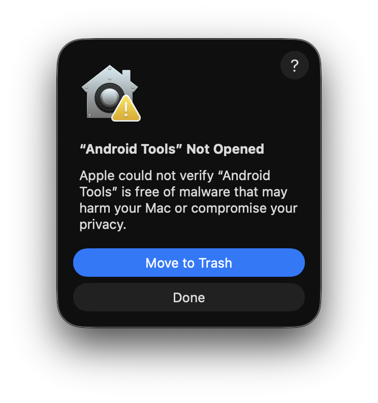
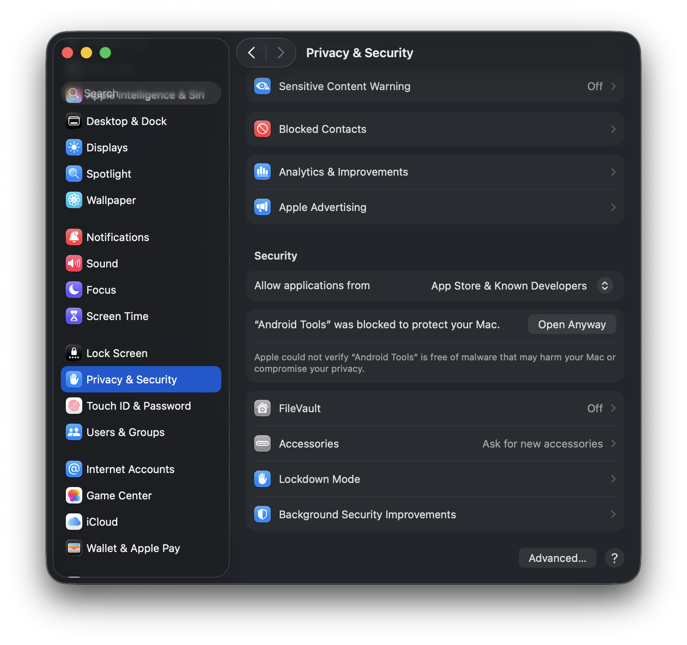
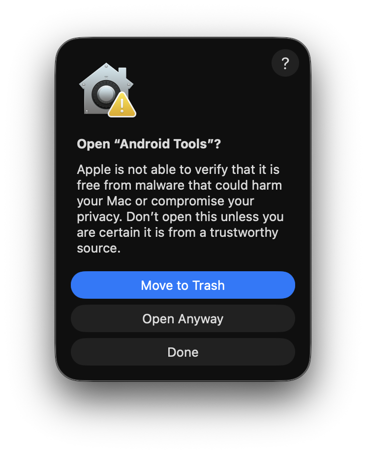

<div align="center">

# 🔧 Android Tools

### A powerful desktop application for managing Android devices

[](https://github.com/ThomasBernard03/AndroidTools/releases)
[](https://flutter.dev)
[](LICENSE)
[](https://github.com/ThomasBernard03/AndroidTools)

[Features](#features) • [Installation](#installation) • [Usage](#usage) • [Building](#building) • [Contributing](#contributing)



</div>

---

## 📱 Overview

**Android Tools** is a comprehensive desktop application designed to simplify Android device management. Whether you're a developer, power user, or enthusiast, Android Tools provides an intuitive interface for exploring device files, monitoring logs, and installing applications.

Built with Flutter, it offers a modern, responsive UI that works seamlessly across different platforms.

## ✨ Features

### 🗂️ **File Explorer**
- Browse your Android device's file system with an intuitive, modern interface
- Navigate through folders with breadcrumb navigation
- Preview images, text files, and view detailed file metadata
- Drag and drop files between your computer and device
- Upload and download files with progress indicators
- Support for all common file formats
- File operations: copy, delete, rename, and more

<div align="center">
  
</div>

### 📦 **APK Inspector & Installer**
- Install APK files with a single click or drag and drop
- View detailed APK information (package name, version, permissions)
- Batch installation support for multiple apps
- Track installation history
- Inspect installed applications

<div align="center">
  
</div>

### 📊 **Device Information**
- View detailed device specifications
- Check Android version and build information
- Monitor device status in real-time

<div align="center">
  
</div>

### 📝 **Logcat Viewer**
- Real-time log monitoring with live updates
- Advanced filtering by tag, priority level, and custom search
- Color-coded log levels (Verbose, Debug, Info, Warning, Error)
- Clean, readable log presentation with timestamps
- Clear logs and export functionality

<div align="center">
  
</div>

## 🚀 Installation

### macOS

1. Download the latest release from the [Releases page](https://github.com/ThomasBernard03/AndroidTools/releases)
2. Unzip the downloaded file
3. Double-click `android_tools.app`

   

4. If you see "Android Tools cannot be opened":
   - Go to **System Preferences** → **Privacy & Security**

   

   - Scroll down and click **Open Anyway** next to the Android Tools warning

   

5. The app will launch successfully

### Windows & Linux
Coming soon! Star this repository to get notified when they're available.

## 📋 Prerequisites

- **ADB (Android Debug Bridge)** must be installed and available in your PATH
- **USB Debugging** enabled on your Android device
- **macOS 10.14+** (for macOS users)

## 🎯 Usage

1. **Connect your Android device** via USB
2. **Enable USB Debugging** on your device (Settings → Developer Options → USB Debugging)
3. **Launch Android Tools**
4. **Accept the USB debugging prompt** on your device
5. Your device will appear in the app, ready to use!

### Quick Actions
- 🗂️ **File Explorer** - Browse and manage device files with drag-and-drop support
- 📦 **APK Inspector** - Install apps and view detailed APK information
- 📝 **Logcat** - Monitor real-time device logs with advanced filtering
- ℹ️ **Device Information** - View comprehensive device specifications and status

## 🛠️ Building from Source


### Setup

```bash
# Clone the repository
git clone https://github.com/ThomasBernard03/AndroidTools.git
cd AndroidTools

# Install dependencies
fvm flutter pub get

# Generate code
fvm dart run build_runner build -d
```

### Running the App

```bash
# Run with Sentry (optional, for error tracking)
fvm flutter run --dart-define=SENTRY_DSN=your_sentry_dsn
```

### Building for macOS

```bash
# Build the app
fvm flutter build macos \
  --dart-define=SENTRY_DSN=your_sentry_dsn \
  --obfuscate \
  --split-debug-info=build/debug-info
```

```bash
zip -r android_tools.zip android_tools.app
```

## 🗺️ Roadmap

- [ ] Real-time device connection/disconnection detection
- [ ] Live SQL database viewer
- [ ] Stack similar logcat lines (VSCode-style)
- [ ] Windows and Linux support
- [ ] Screen mirroring

## 🤝 Contributing

Contributions are welcome! Please feel free to submit a Pull Request.

1. Fork the project
2. Create your feature branch (`git checkout -b feature/AmazingFeature`)
3. Commit your changes (`git commit -m 'Add some AmazingFeature'`)
4. Push to the branch (`git push origin feature/AmazingFeature`)
5. Open a Pull Request

## 📝 Development Notes

### Code Generation
The project uses build_runner for code generation. Run this after modifying models or database schemas:

```bash
fvm flutter clean && fvm flutter pub get && fvm dart run build_runner build -d
```

### Sentry Integration
For error tracking, set your Sentry DSN:

```dart
--dart-define=SENTRY_DSN=your_sentry_dsn
```

### Auto-Updater
Configure auto-updates by setting the feed URL:

```dart
--dart-define=AUTO_UPDATER_FEED_URL=your_feed_url
```

## 📄 License

This project is licensed under the MIT License - see the [LICENSE](LICENSE) file for details.

## 🙏 Acknowledgments

- Built with [Flutter](https://flutter.dev)
- ADB integration via [adb_dart](https://pub.dev/packages/adb_dart)
- AAPT integration via [aapt_dart](https://pub.dev/packages/aapt_dart)
- Auto-updates powered by [auto_updater](https://pub.dev/packages/auto_updater)

---

<div align="center">

**Made with ❤️ for the Android developer community**

[Report Bug](https://github.com/ThomasBernard03/AndroidTools/issues) • [Request Feature](https://github.com/ThomasBernard03/AndroidTools/issues)

</div>
